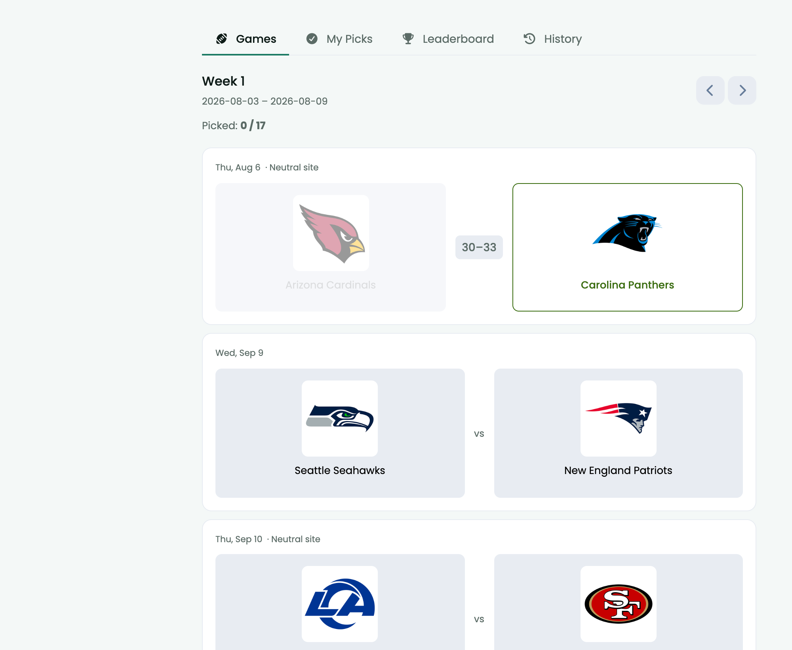

# Picks

[](https://floxum.com/extension/ernestdefoe/picks)
[](https://floxum.com/extension/ernestdefoe/picks)
[](https://floxum.com/extension/ernestdefoe/picks)
[](https://floxum.com/extension/ernestdefoe/picks)
[](https://floxum.com/extension/ernestdefoe/picks)

A [Flarum](https://flarum.org) 2.x extension that adds a **pick'em** game to
your forum. Members predict the winners of each week's games, earn points, and
compete on a season leaderboard.

A season belongs to a league: college football, the NFL, the NBA, MLB, the NHL,
MLS or the Premier League. College football is synced from
[CollegeFootballData](https://collegefootballdata.com); everything else comes
from ESPN, which needs no API key. Live scores and team crests come from ESPN
throughout.



## Features

- **Weekly picks** — members pick winners for each game in a week; picks lock at
  kickoff (with an optional offset).
- **Live scoring** — a scheduled task polls ESPN for in-progress scores and grades
  picks automatically as games finish.
- **Leaderboard** — season standings with per-week history and per-user pick
  history (`/u/{username}/picks-history`).
- **Confidence mode (optional)** — members rank their picks by confidence for
  weighted scoring, with a configurable penalty for missed high-confidence picks.
- **Admin management** — sync teams/schedule/scores, open/unlock weeks, enter or
  override results, refresh team logos, and reset data, all from the admin panel.
- **Per-permission access** — separate abilities for viewing, making picks,
  viewing history, and managing.

## Requirements

- Flarum `^2.0`
- A free **CollegeFootballData API key** — get one at
  <https://collegefootballdata.com/key> (used for team and schedule syncing).

## Installation

```bash
composer require ernestdefoe/picks
php flarum cache:clear
```

Then enable **Picks** in the admin panel under Extensions.

## Setup

1. Open the **Picks** page in the admin panel.
2. Paste your **CFBD API key** and set the **season year** (and optionally a
   conference filter).
3. **Sync Teams**, then **Sync Schedule** to pull the season's games.
4. **Open** the week(s) you want members to pick.
5. Grant the picks permissions to the appropriate groups (see below).

To keep live scores updating, make sure Flarum's scheduler is running (see
**Scheduler** below) and enable **ESPN polling** in the settings.

## Permissions

Set these under **Admin → Permissions**:

| Ability | Lets a user… |
|---|---|
| `picks.view` | See the Picks page and leaderboard. |
| `picks.makePicks` | Submit and change their own picks. |
| `picks.viewHistory` | View pick history for users. |
| `picks.manage` | Manage the game (sync, results, weeks, settings). Admins always have this. |

## Settings

Configured on the admin **Picks** page (stored under the `ernestdefoe-picks.*`
namespace):

- **CFBD API key**, **season year**, **conference filter**
- **Sync regular season / postseason**, **auto-sync**
- **Picks lock offset** (minutes before kickoff)
- **Confidence mode** + **confidence penalty** (`none` / `half` / `full`)
- **Auto-unlock weeks**, **default week view**
- **ESPN polling** + **poll interval**
- **Nav label** (the forum nav link text)

## Scheduler

Live-score polling runs as a scheduled command (`PollLiveScoresCommand`, every 5
minutes). For it to fire, Flarum's scheduler must be invoked once a minute by
cron:

```cron
* * * * * cd /path/to/forum && php flarum schedule:run >> /dev/null 2>&1
```

You can also run syncs manually:

```bash
php flarum picks:sync-teams        # sync the FBS team list from CFBD
php flarum picks:poll-scores       # poll ESPN for live scores once
php flarum picks:sync-espn         # fixtures and scores for non-college seasons
php flarum picks:sync-box-scores   # box scores for finished games
```

## More than one sport

A season belongs to a **league**, and the league decides where its fixtures come
from and how a game is described:

| League | Source | Vocabulary |
|---|---|---|
| College football | CollegeFootballData | gridiron |
| NFL | ESPN | gridiron |
| NBA, college basketball | ESPN | basketball |
| MLB | ESPN | baseball |
| NHL | ESPN | ice hockey |
| MLS, Premier League, Champions League | ESPN | football |

Create a season, set its league, and run `picks:sync-espn`. Nothing else
changes: the same tables, the same picks, the same leaderboard. A board that
follows only college football carries on exactly as before — every existing
season defaults to it, because every existing row came from there.

Adding a league is one line in `Service\Leagues\Leagues`, because ESPN answers
every one of these in the same shape.

Two things are worth knowing:

**Most sports have no weeks.** Gridiron numbers its rounds; everything else is
played to a date. A league without weeks gets one week per calendar week, which
is what a pick'em for those sports is anyway — you pick this week's games. The
deadline is each game's own kickoff rather than the start of the round, because
one deadline across seven days either closes Monday's game on Saturday morning
or lets somebody pick a game they have already watched.

**A drawn match is void.** Football arrived with a result this scoring had never
had to hold. The picker offers home or away, so on a draw nobody picked the
result — those picks stay unscored and the match simply does not affect the
table, rather than counting as a loss for everybody.

## Data sources

- **CollegeFootballData (CFBD)** — college football teams, schedules and box
  scores. Needs an API key.
- **ESPN** — every other league's fixtures, scores and box scores, plus team
  logos and live in-game scores everywhere. Public endpoints, no key.

🚨 A box score from ESPN is **one call per game**, where CFBD answers a whole
week at once — so the fetch is capped per run and picks up where it left off.
A Saturday of college basketball is a hundred and fifty games, and a scheduled
job that fired a hundred and fifty outbound requests inside a minute is how a
forum takes itself down.

Team names, logos, and data are the property of their respective owners and the
providers above. This is an unofficial fan tool and is not affiliated with or
endorsed by the NCAA, CFBD, ESPN, or any team.

## Credits

Based on [huseyinfiliz/pickem](https://github.com/huseyinfiliz/pickem) by Hüseyin Filiz.
Subsequently forked by [resofire](https://github.com/resofire) and now maintained by
[ernestdefoe](https://github.com/ernestdefoe) as `ernestdefoe/picks`.

## Support

Questions, bug reports, and feature requests:

- **Support forum:** https://ernestdefoe.online
- **Issues:** https://github.com/ernestdefoe/picks/issues

## License

MIT
